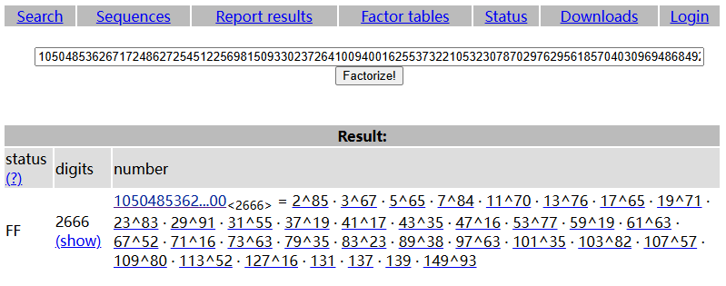

<head>
    <script src="https://cdn.mathjax.org/mathjax/latest/MathJax.js?config=TeX-AMS-MML_HTMLorMML" type="text/javascript"></script>
    <script type="text/x-mathjax-config">
        MathJax.Hub.Config({
            tex2jax: {
            skipTags: ['script', 'noscript', 'style', 'textarea', 'pre'],
            inlineMath: [['$','$']]
            }
        });
    </script>
</head>

# Crypto-WarmUp 题目思路解析

题目源代码（`WarmUp.py`）：

```python
from Flag import FLAG
from Crypto.Util.number import sieve_base

n = 1
m = min(FLAG)
for i in range(len(FLAG)):
    n *= sieve_base[i] ** (FLAG[i] - m + 1)

with open(r'./output.txt', 'w') as f: 
    print(f"{type(FLAG) = }", file=f)
    print(f"{n = }", file=f)
    print(f"{m = }", file=f)
```

题目附件（`output.txt`）内容：

```txt
type(FLAG) = <class 'bytes'>
n = ...
m = 33
```

> 注：由于`n`数字太大，此处省略了`n`的内容

## 1. 题干分析

先让我们详细理解题目代码：

```python
from Flag import FLAG
```

这行代码尝试从名为`Flag.py`的文件中导入一个名为`FLAG`的变量，也就是我们需要提交的`flag`，我们需要通过题目的内容解出`FLAG`的值。

```python
from Crypto.Util.number import sieve_base
```

这行代码从`Crypto.Util.number`模块导入了`sieve_base`列表，该列表按照从小到大的顺序存放了所有小于10000的质数。

```python
n = 1
```

初始化一个变量`n`为`1`，这个变量将用于后续的乘法运算。

```python
m = min(FLAG)
```

计算`FLAG`中的最小值，并将其赋值给变量`m`。后面可以看到这里的`FLAG`为`bytes`类型（字节类型），在python中单个字节的值会被理解成`int`类型（ASCII码），所以这里`min(FLAG)`返回的是一个整数。

```python
for i in range(len(FLAG)): 
    n *= sieve_base[i] ** (FLAG[i] - m + 1)
```    
这个循环遍历`FLAG`中的每个元素。然后对于`FLAG`中的每个元素，使用`sieve_base`函数返回的素数列表中的相应素数（即第`i`个素数），计算一个幂，并将其乘以`n`。这个幂是`FLAG[i] - m + 1`，其中`FLAG[i]`是FLAG列表中的第`i`个元素。

写成数学公式就是：

设 $\text{FLAG} = a_1a_2\cdots a_l$ ，其中 $a_i$ 是 $FLAG$ 中的第 $i$ 个字节（元素），$l$为`FLAG`的长度，$p_i$ 是素数列表中的第 $i$ 个素数，那么就有：

$$
n = p_1^{a_1 - m + 1}\cdots p_l^{a_l - m + 1}
$$


```python
with open(r'./output.txt', 'w') as f:
    print(f"{type(FLAG) = }", file=f)
    print(f"{n = }", file=f)
    print(f"{m = }", file=f)
```

这段代码打开（或创建）一个名为`output.txt`的文件，并以写入模式打开。`r`前缀表示原始字符串，这样反斜杠就不会被解释为转义字符。然后分别打印`FLAG`的数据类型、变量`n`、变量`m`的值到文件中。

### 总结

这段代码在`output.txt`文件中记录了`FLAG`的数据类型、`n`的值和`m`的值。`n`的值是通过将`FLAG`中的每个元素对应的素数的相应的幂次方相乘得到的。

## 2.思路解析

### 我们先梳理一下条件：

- `FLAG`为字节类型
- 知道`m`，`n`
- 因为`sieve_base`为库`Crypto.Util.number`中的内容，因此我们也知道，即知道 $p_i$。  
- 知道关系 $n = p_1^{a_1 - m + 1}\cdots p_l^{a_l - m + 1}$ ，但是不知道素数有多少个，以及每个素数的幂次。

我们想要恢复`FLAG`，那就需要恢复 $n$ 的分解中每个素数的幂次。

### 我们的目标：

根据正整数素因子分解的唯一性（算术基本定理），只需要将题给 `n` 进行素因子分解即可。

### 我们最后得出思路：

注意到 `sieve_base` 的存在使我们知道 `n` 的所有素因子是多少，因此我们直接使用试除法对`n`进行分解，即可恢复出`FLAG`。

## 3. 解题实现

#### 方法一：试除法

```python
n = # 请自行补充n的值

from Crypto.Util.number import sieve_base

clist = []
for i in sieve_base:
    tmp_n = n
    j = 0
    while tmp_n % i == 0:
        tmp_n = tmp_n // i
        j += 1
    if j == 0: break
    clist.append(j)

m = 33
print(bytes([i + m - 1 for i in clist]))
```

#### 方法二：使用现成的工具

这里我们使用`www.factordb.com`网站：



然后根据`m`的值，即可恢复`FLAG`每个字节的ASCII码，从而得到`FLAG`。

当然也可以使用相应的api：

```python
import requests

def queryFactors(n):
    url = "http://factordb.com/api?query="+str(n)
    r = requests.get(url)
    factors = r.json()['factors']
    return [x[1] for x in factors]

clist = queryFactors(n)
m = 33

print(bytes([i + m - 1 for i in clist]))
```

> 当然还有许多其他方法，如利用`sympy`中的`factorint`函数，利用工具`yafu`进行素因子分解等等。

#### 其他补充

- [**FactorDB**](http://factordb.com/)
- [**Yafu**](https://blog.csdn.net/BLACK_life_book/article/details/130935606)
- [**Crypto库**](https://www.cnblogs.com/coming1890/p/13506932.html)
- [**SymPy**](https://www.cnblogs.com/YuanZiming/p/13070883.html)
- [**Sagemath**](https://hasegawaazusa.github.io/sagemath-get-started.html)

## 4.最终结果

```txt
ucatflags{W31C0m3_T0_C7F_CrYpT0!!!}
```