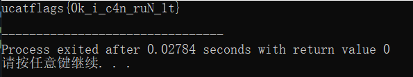

# 解题过程

## 1. 题目名称及描述

### 1.1. 题目名称

helpme

### 1.2 题目描述

解开程序中的秘密

## 2. 题目部署方法

提供附件给选手下载

### 2.1. 解题过程

1. 改正代码：

```C
#include <stdio.h>                     // 中文《》改为<>

#define len 16                         // defien改为define
char flags[len] = "t1_Nur_n4c_i_k0";   // '改为"

void reverse (char *ans) {             // viod改为void
	int now = 0;                        // 等号右边英文字母o改为数字0
	while (now < len - 2 - now) {       // 删去()右边的分号;否则将死循环
		char c = ans[now];               // 中文分号；改为英文分号;     
		ans[now] = ans[len - 2 - now];   // 将==改成=（==用来判断相等而不是赋值）
		ans[len - 2 - now] = c;          // asn改成ans
		now++;                           // +改成++
	}
	printf("ucatflags{%s}\n", ans);     // 输出时调用的函数是printf()而不是print()
}                                      // 补上}，否则括号不匹配

int main() {                           // mian改成main
	reverse(flags);                     // 补上缺少的分号;以及将flag改成flags
	return 0;                           // retun改成return
}

```

2. 运行改正后的代码获得flag

   

## 2. 相关问题

### 2.1 题目分值


**50分**

### 2.2 题目flag

> 给出题目的flag及修改flag的方法

`ucatflags{th1s_i5_an_3xample}`

### 2.3 需注意的问题

> 介绍部署题目、解题过程需要注意的一些问题；如果需要监控服务器，请给出监控方法

## 附件列表

- **附件1：题目源代码**
- **附件2：解题工具**
- **附件3：选手下载附件**
