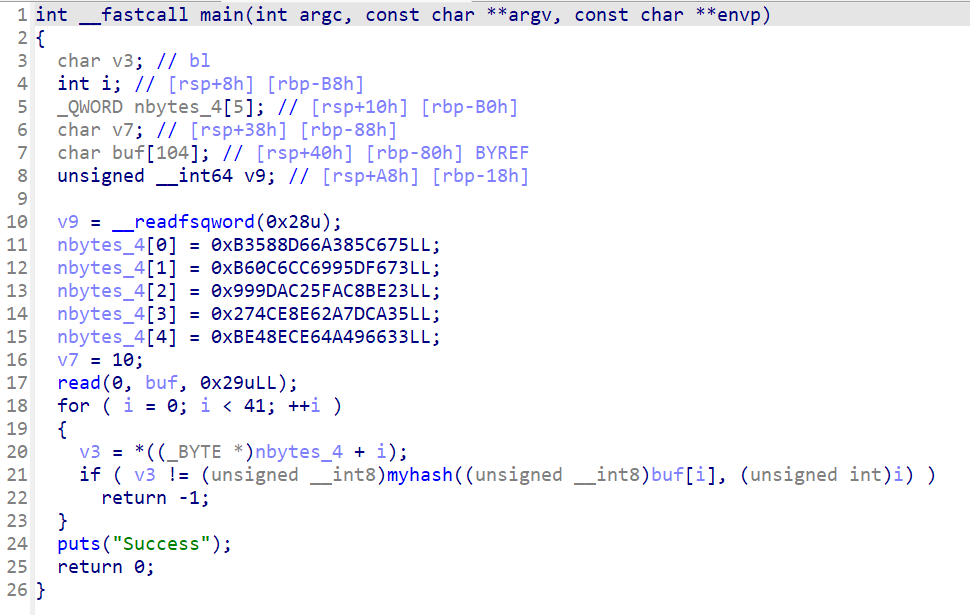
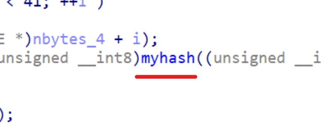
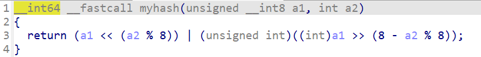

# Re-WarmUp思路解析

题目给了我们一个二进制文件，不难看到这是一个ELF文件。

> 常见的可执行文件格式有**ELF格式（Linux平台）和PE格式（Windows平台）**，本题给定的是一个ELF文件。

使用ida（请大家自行安装）查看，按F5获得反汇编代码，可以得到如下结果（main函数）：



即：

```c
int __fastcall main(int argc, const char **argv, const char **envp)
{
  char v3; // bl
  int i; // [rsp+8h] [rbp-B8h]
  _QWORD nbytes_4[5]; // [rsp+10h] [rbp-B0h]
  char v7; // [rsp+38h] [rbp-88h]
  char buf[104]; // [rsp+40h] [rbp-80h] BYREF
  unsigned __int64 v9; // [rsp+A8h] [rbp-18h]

  v9 = __readfsqword(0x28u);
  nbytes_4[0] = 0xB3588D66A385C675LL;
  nbytes_4[1] = 0xB60C6CC6995DF673LL;
  nbytes_4[2] = 0x999DAC25FAC8BE23LL;
  nbytes_4[3] = 0x274CE8E62A7DCA35LL;
  nbytes_4[4] = 0xBE48ECE64A496633LL;
  v7 = 10;
  read(0, buf, 0x29uLL);
  for ( i = 0; i < 41; ++i )
  {
    v3 = *((_BYTE *)nbytes_4 + i);
    if ( v3 != (unsigned __int8)myhash((unsigned __int8)buf[i], (unsigned int)i) )
      return -1;
  }
  puts("Success");
  return 0;
}
```

这段代码看起来是用C语言编写的，并且可能是从汇编代码反编译得到的。下面是逐行的解释：

```c
int __fastcall main(int argc, const char **argv, const char **envp)
{
```
这是主函数的声明，`__fastcall` 是一个调用约定，它指定了函数参数如何被传递和存储。`main` 函数接受三个参数：`argc`（参数计数），`argv`（参数值数组），`envp`（环境变量数组）。

```c
  char v3; // bl
  int i; // [rsp+8h] [rbp-B8h]
  _QWORD nbytes_4[5]; // [rsp+10h] [rbp-B0h]
  char v7; // [rsp+38h] [rbp-88h]
  char buf[104]; // [rsp+40h] [rbp-80h] BYREF
  unsigned __int64 v9; // [rsp+A8h] [rbp-18h]
```
这些是局部变量的声明。`v3` 和 `v7` 是字符型变量，`i` 是整型变量，`nbytes_4` 是一个包含5个64位整数的数组，`buf` 是一个字符数组，`v9` 是一个64位无符号整数。

```c
  v9 = __readfsqword(0x28u);
```
这行代码读取了特定的数据。`__readfsqword` 是一个内联汇编函数，它从特定的内存位置读取一个64位值。`0x28u` 是一个偏移量，这个值通常是线程环境块（TEB）中的一个字段。**在这里我们可以暂时不管。**

```c
  nbytes_4[0] = 0xB3588D66A385C675LL;
  nbytes_4[1] = 0xB60C6CC6995DF673LL;
  nbytes_4[2] = 0x999DAC25FAC8BE23LL;
  nbytes_4[3] = 0x274CE8E62A7DCA35LL;
  nbytes_4[4] = 0xBE48ECE64A496633LL;
```
这些行初始化了`nbytes_4`数组的元素，每个元素都被赋予了一个大的十六进制数。

```c
  v7 = 10;
```
这行代码将字符变量`v7`设置为10，这在ASCII中对应于换行符`\n`。

```c
  read(0, buf, 0x29uLL);
```
这行代码从文件描述符0（通常是标准输入）读取数据到`buf`数组中，最多读取`0x29`（41）个字节。

```c
  for ( i = 0; i < 41; ++i )
  {
    v3 = *((_BYTE *)nbytes_4 + i);
    if ( v3 != (unsigned __int8)myhash((unsigned __int8)buf[i], (unsigned int)i) )
      return -1;
  }
  puts("Success");
```
这是一个循环，它遍历`buf`数组的前41个字节。对于每个字节，它比较`nbytes_4`数组中相应位置的字节和`buf`数组中该位置字节通过`myhash`函数计算出的值。如果有任何不匹配，函数返回-1，如果循环完成而没有返回-1，这意味着所有的值都匹配，所以这行代码输出字符串"Success"到标准输出。**这意味着我们需要通过`nbytes_4`数组中的值，来反推出合理的输入是什么**。

对`myhash`我们双击该函数即可以进入得到函数的源码。



进入到`myhash`函数如下所示：


即：
```c
__int64 __fastcall myhash(unsigned __int8 a1, int a2)
{
  return (a1 << (a2 % 8)) | (unsigned int)((int)a1 >> (8 - a2 % 8));
}
```

这个函数接受两个参数：`a1`和`a2`。它首先将`a1`左移`a2 % 8`的位数，然后将`a1`右移`8 - a2 % 8`的位数，然后将这两个值相或得到最终的结果。即一个简单的对`char`进行位旋转的操作：

```
以 a1 = 0xAB, a2 = 3 为例：
a1 的二进制表示为：0b10101011
即：
a1 = 0xAB = 0b10101011
↓
1 0 1 0 1 0 1 1
↓
1 0 1 | 0 1 0 1 1
↓
0 1 0 1 1 | 1 0 1
↓
0 1 0 1 1 1 0 1
↓
return 0x5D
```

这一个过程是完全可逆的，我们只需要根据`a2`的值把结果反推回去即可。

现在的核心是知道`buf`数组的具体内容，这里的数据是在计算机中以小端序存储的，所以如果把`buf`改写成`char`的数组，就如下所示：

```c
unsigned char nbytes_4[] = {
    0x75, 0xc6, 0x85, 0xa3, 0x66, 0x8d, 0x58, 0xb3, 
    0x73, 0xf6, 0x5d, 0x99, 0xc6, 0x6c, 0x0c, 0xb6, 
    0x23, 0xbe, 0xc8, 0xfa, 0x25, 0xac, 0x9d, 0x99, 
    0x35, 0xca, 0x7d, 0x2a, 0xe6, 0xe8, 0x4c, 0x27, 
    0x33, 0x66, 0x49, 0x4a, 0xe6, 0xec, 0x48, 0xbe, 
    0x0a
};
```

对上述数组利用类似方法反推回去即可获得flag。

当然你也可以改写代码为如下形式：
```c
# include <stdio.h>

__int64 __fastcall inv_myhash(unsigned __int8 a1, int a2){
    return (a1 << (8 - a2 % 8)) | (unsigned int)((int)a1 >> (a2 % 8));
}

int __fastcall main(int argc, const char **argv, const char **envp){
  char v3; // bl
  int i; // [rsp+8h] [rbp-B8h]
  long long nbytes_4[5]; // [rsp+10h] [rbp-B0h]

  nbytes_4[0] = 0xB3588D66A385C675LL;
  nbytes_4[1] = 0xB60C6CC6995DF673LL;
  nbytes_4[2] = 0x999DAC25FAC8BE23LL;
  nbytes_4[3] = 0x274CE8E62A7DCA35LL;
  nbytes_4[4] = 0xBE48ECE64A496633LL;
  for (i = 0; i < 41; ++i ){
    v3 = *((char *)nbytes_4 + i);
    printf("%c", (unsigned __int8)inv_myhash(v3, (unsigned int)i));
  }
  puts("Success");
  return 0;
}
```

最后获得flag：
```txt
ucatflags{W3lc0m#_2_Rev35e_EnG1N33RIng!}
```
